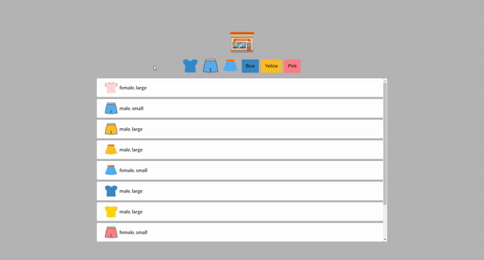

<div align="center">
  <br />
  
  <h1>미니 온라인 쇼핑몰 (Mini Online Shopping Mall)</h1>
  <a href="https://app.netlify.com/sites/stoic-mcclintock-a1a54d/deploys">
    
  </a>
  <br />
</div>

## 목차

1. [**웹 서비스 소개**](#1)
2. [**기술 스택**](#2)
3. [**주요 기능**](#3)
4. [**주요 페이지**](#4)
5. [**실행 방법**](#5)

<br />

<div id='1'></div>

## 💁🏻‍♂ 웹 서비스 소개

필터 기능만을 구축한 **미니 온라인 쇼핑몰**입니다.

<br />

[**🔗 배포된 웹 서비스로 바로가기 Click !**](https://stoic-mcclintock-a1a54d.netlify.app/) 👈

> 새 창 열기 방법 : CTRL+click (on Windows and Linux) | CMD+click (on MacOS)

<br />

<div id='2'></div>

## 🛠 기술 스택

**Front-end**

-   

**DevOps**

- 
-  

<br />

<div id='3'></div>

## 💡 주요 기능

- 상단에 위치한 버튼을 통해 원하는 카테고리 아이템들만 사용자에게 제공합니다.

<br />

<div id='4'></div>

## 📄 주요 페이지

|                             메인 페이지                             |
| :-----------------------------------------------------------------: |
|  |

<br />

<div id='5'></div>

## 💻 실행 방법

1. **원격 저장소 복제**

```bash
$ git clone https://github.com/JeongHwan-dev/mini-online-shopping-mall.git
```

2. **프로젝트 폴더로 이동**

```bash
$ cd mini-online-shopping-mall
```

3. **필요한 node_modules 설치**

```bash
$ npm install
```

4. **개발 서버 실행**

```bash
$ npm run dev
```
